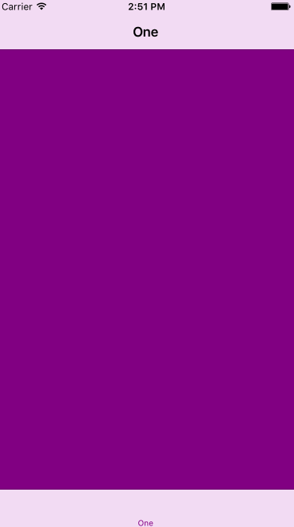
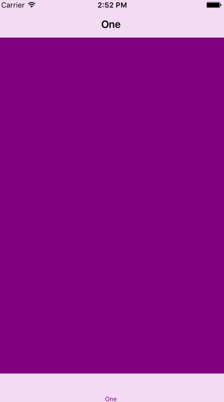
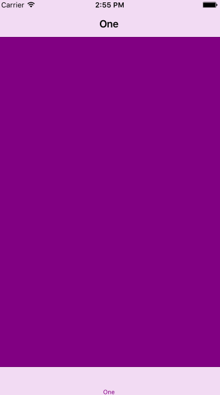

# UIWindow-Transition
UIWindow transition effects while changing window's rootViewController

# Usage

```swift
UIApplication.sharedApplication().keyWindow?.transitRootVc(yourTabBarTwoController(), style: transitionType, duration: nil)
/* there are 11 kinds of transition effects, .None effect and .Random effect are also available
transitionType:  None, 
                 ZoomOut,
                 ZoomIn,
                 Dissolve,
                 SliceVertical,
                 SliceHorizontal,
                 FlipFromLeft,
                 FlipFromRight,
                 FlipFromTop,
                 FlipFromBottom,
                 CurlUp,
                 CurlDown,
                 Random
  */
```

# Install

- use cocoapods
```swift
pod 'UIWindow-Transition', '~> 0.0.2'
```
- manual import
```swift
just download lib folder and add into your project
```

# Screenshot

- ZoomOut effect



- ZoomIn effect


- Dissolve effect



- SliceVertical effect


- SliceHorizontal effect


- FlipFromLeft effect


- FlipFromRight effect


- FlipFromTop effect


- FlipFromBottom effect


- CurlUp effect



- CurlDown effect


# Release notes

- 0.0.1

`release first version.`
